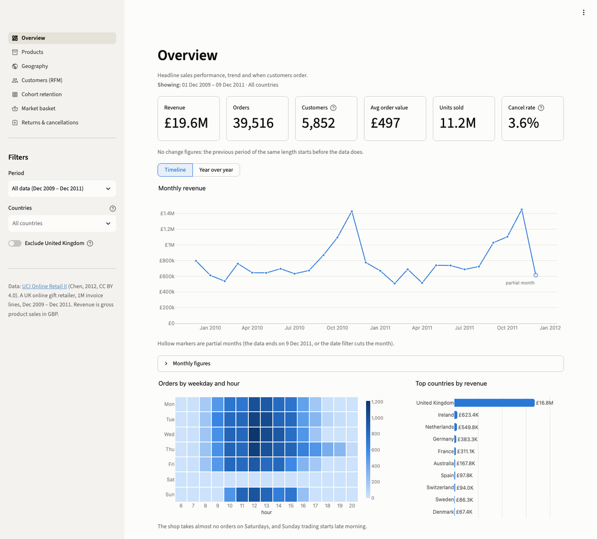
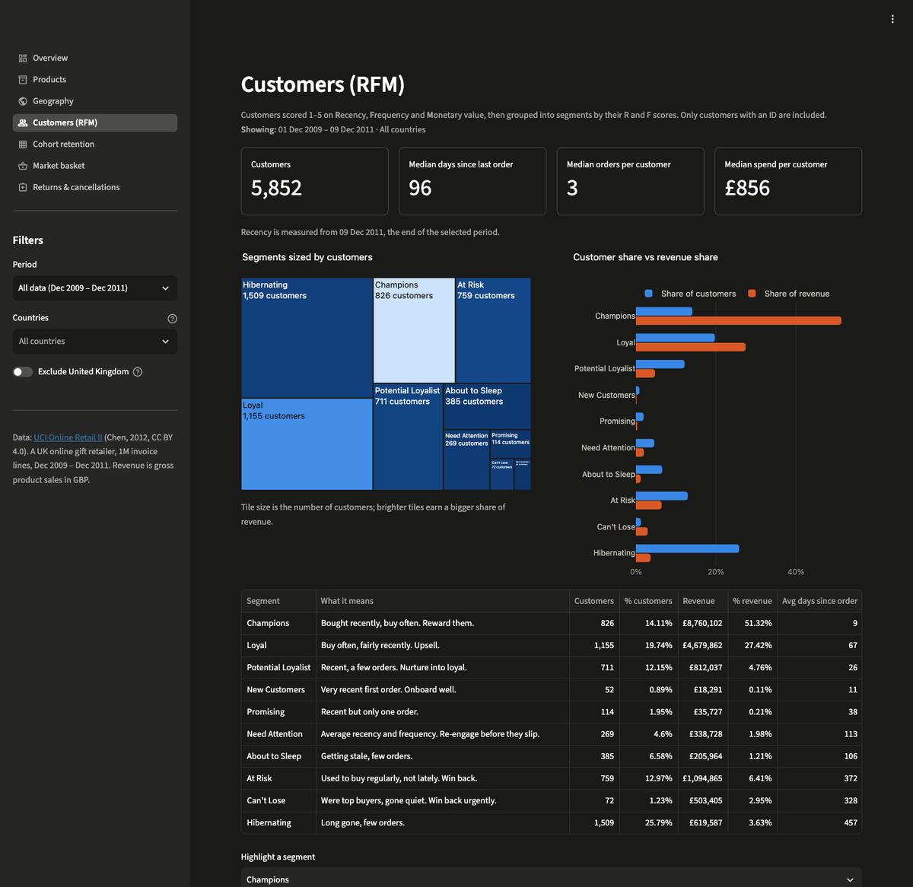
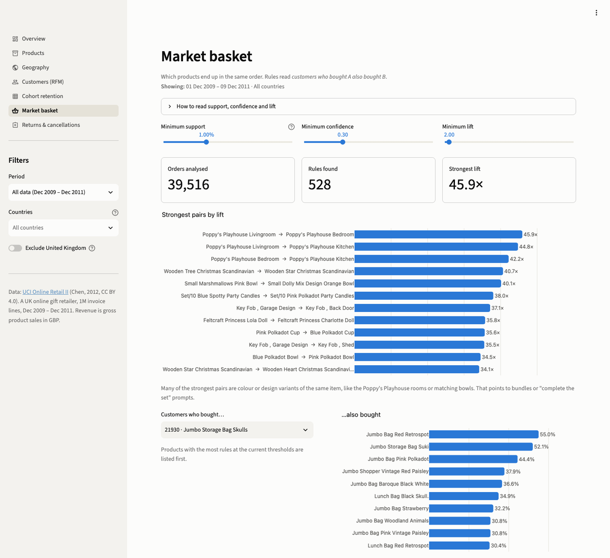
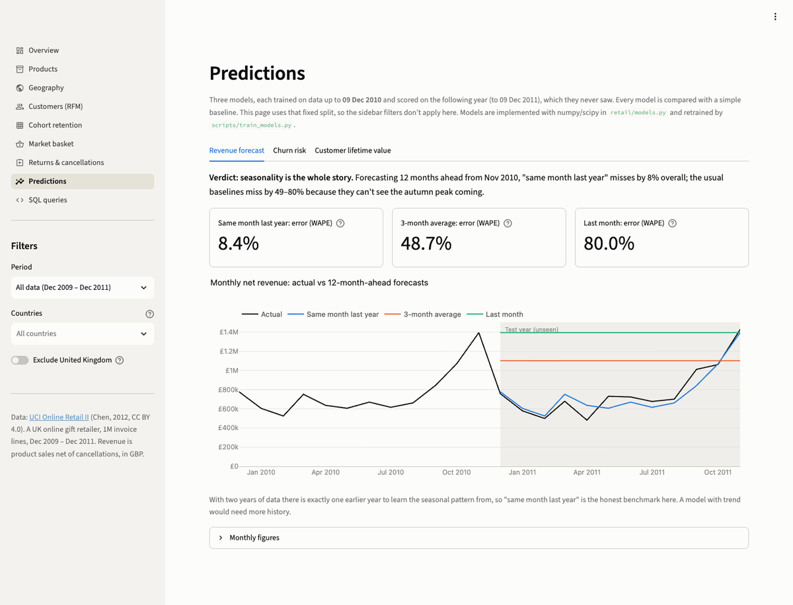
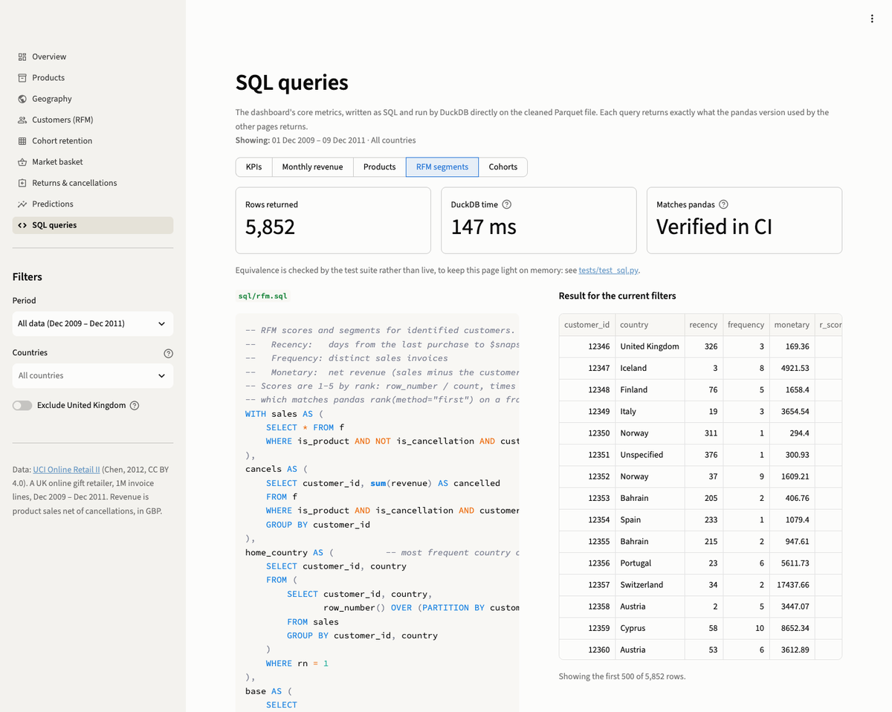

# E-Commerce Product Analytics Dashboard

[](https://github.com/aayushgupta6720-ops/ecommerce-analytics-dashboard/actions/workflows/ci.yml)

An interactive analytics dashboard for the [UCI Online Retail II](https://archive.ics.uci.edu/dataset/502/online+retail+ii)
dataset: 1,067,371 invoice lines from a UK online gift retailer, December 2009 to December 2011. It's built
with Streamlit and Plotly, and there's a matching Power BI kit.

**Live demo:** https://ecommerce-analytics-dashboard-aapp.onrender.com. It runs on Render's free plan,
which sleeps after 15 minutes idle, so the first visit can take about a minute to wake up.



## What's in it

Eleven pages. The seven analysis pages respond to the sidebar filters (period, countries, *Exclude United Kingdom*), and the SQL page runs its queries with them too. Insights and Predictions use the full two years, and Ask the data takes its period and countries from the question.

| Page | What it answers |
|---|---|
| **Overview** | Revenue, orders, customers, AOV, units and cancellation rate, with change vs the previous period. Monthly trend with a year-over-year view. Weekday × hour heatmap. Top countries. |
| **Products** | Top N products by revenue, units or orders. Pareto curve (22% of products bring in 80% of revenue). Per-product drill-down: monthly sales, price points, countries. |
| **Geography** | Choropleth, country table, highest average order values, revenue by region. |
| **Customers (RFM)** | Recency/Frequency/Monetary scores and 10 segments. Customer share vs revenue share (Champions are 14% of customers and 52% of revenue). Every-customer scatter. CSV export. |
| **Cohort retention** | Monthly acquisition cohorts × months since first order: retention %, active customers or revenue. |
| **Market basket** | Pairwise association rules (support, confidence, lift) with adjustable thresholds and a *customers who bought X also bought* lookup. |
| **Returns & cancellations** | Cancellation rate over time, largest single cancellations, most-cancelled products, and cancellations by country and by customer. |
| **Insights & actions** | Five prioritised recommendations, each with evidence, an action, value at stake under adjustable assumptions, and a KPI; downloadable win-back and watch lists. |
| **Ask the data** | Type a question in plain English ("top 5 products by units in November 2010") and get the answer as a number, chart or table, computed by the same metric code as every other page. |
| **Predictions** | Revenue forecast, churn risk and customer lifetime value, each trained on 2010 and scored on the following year against a baseline. |
| **SQL queries** | The core metrics (KPIs, monthly revenue, products, RFM, cohorts) as SQL, run live by DuckDB on the Parquet file. |

| Customers (RFM), dark theme | Market basket |
|---|---|
|  |  |

## Quick start

```bash
python3.12 -m venv venv
./venv/bin/pip install -r requirements-dev.txt
./venv/bin/streamlit run app.py
```

The cleaned dataset (`data/processed/transactions.parquet`, 7.5 MB) is committed, so the app runs without
downloading anything. To rebuild it from the source file (the download is 45 MB; parsing the xlsx takes a
few minutes):

```bash
./venv/bin/python scripts/build_dataset.py
```

## Data cleaning

`scripts/build_dataset.py` downloads the UCI zip, reads both sheets, and logs every step:

| Step | Rows |
|---|---:|
| Raw (two sheets: 525,461 + 541,910) | 1,067,371 |
| Drop exact duplicates (the sheets overlap on 1–9 Dec 2010, and some lines repeat within a sheet) | −34,335 |
| Drop bad-debt adjustment invoices (`A…`) | −6 |
| Drop lines with price ≤ 0 (stock write-offs, samples) | −6,014 |
| Drop cancellations with a positive quantity | −1 |
| **Clean** | **1,027,015** |

Rows aren't dropped for being cancellations or non-product lines. Instead they're flagged:
- `is_cancellation`: the invoice number starts with `C`.
- `is_product`: the stock code matches `^\d{5}[A-Z]*$`. This excludes POST, DOT, M, bank charges,
  Amazon fees, gift vouchers and similar.

Each stock code gets one canonical description (its most common one), and a few country names are
cleaned up (EIRE → Ireland, RSA → South Africa, USA → United States).

## Metric definitions

All metrics live in [`retail/metrics.py`](retail/metrics.py): pure pandas functions with no Streamlit
code, unit-tested on hand-computed fixtures.

- **Revenue**: product sales **net of cancellations**, quantity × price in GBP, excluding non-product lines.
  Cancelled lines carry negative revenue, so an order placed and then cancelled in full nets to zero. Before
  this rule, one 80,995-unit order that was cancelled the same day ranked as the #4 product by revenue.
  **Gross sales** (before cancellations) appear on the Returns page. **Orders**: distinct sales invoices.
  **AOV**: net revenue ÷ orders. **Units** are net of cancelled units.
- **Customers**: distinct customer IDs. About 23% of sales lines have no customer ID. They count towards
  revenue, products and countries, but not towards RFM or cohorts.
- **Change vs previous period**: compared with the window of the same length just before the selected
  one. It's hidden when that window starts before the data does.
- **Cancellation rate**: value of cancelled product lines ÷ gross sales. Two orders placed and
  cancelled in full account for 34% of all cancelled value; the Returns page shows them.
- **RFM**:
  - The snapshot date is the day after the selected period ends.
  - Scores are quintiles taken on rank, so ties and small selections never produce duplicate bin edges.
  - Segments come from the standard 10-segment map of R and F scores.
- **Cohorts**: a customer's cohort is the month of their first purchase in the **full** dataset, so
  narrowing the date filter never relabels a returning customer as new. The Dec 2009 cohort also holds
  customers who were already buying before the data starts.
- **Market basket**: pairs are computed from a sparse invoice × product matrix (`Xᵀ·X`) after dropping
  products below minimum support. This takes about 0.2s on 40k orders and avoids the dense one-hot
  matrix that apriori libraries build.
- The **last month is partial** (the data ends on 9 Dec 2011). Trend charts mark it with a hollow point.

## Insights & actions

The page turns the analysis into five recommendations. Values are sized with assumptions you can change on the
page, using the defaults shown below. They're sized opportunities, not forecasts.

| # | Recommendation | Evidence | Value at stake (default assumption) |
|---|---|---|---|
| 1 | Keep Champions buying (VIP tier, monthly watch list from the churn model) | 14% of customers bring in 52% of revenue (£4.5M in the last year); none currently in the riskiest 20% | £225K a year protected if a VIP tier keeps 5% of their revenue |
| 2 | Win back lapsed high-value customers, with a hold-out group | 831 At Risk / Can't Lose customers spent £1.18M in their last active year | £118K a year at a 10% win-back rate |
| 3 | Plan stock and staff for September–November | 36–38% of annual revenue in both years; November about 1.8× an average month | £70K a season if 2% of peak demand is lost today |
| 4 | Turn guest checkouts into accounts | 13% of gross sales (£1.3M a year) come from orders that can't be contacted | £382K a year made reachable at 30% conversion |
| 5 | Confirm bulk orders before picking | 40 cancelled lines of 1,000+ units are 40% of cancelled value; about 13 large lines a month to check | £14K a year of handling at 10% of goods value |

It also shows what was **considered and not prioritised**. "Complete the set" prompts for the strongest product
pairs would be worth at most about £22K, even if every order missing a partner item had added it. The page
shows that too, because knowing what not to do matters as much.

## Ask the data

Type a question in plain English and get the answer from the data. The language model (Gemini 3.5 Flash-Lite,
free tier) has one job: turn the question into a small structured request. **It never writes code or produces
the numbers.**

1. **Question → request.** One call with a JSON schema whose fields are fixed lists: measure (net revenue, gross
   sales, orders, customers, AOV, units, distinct products, cancelled value, cancellation rate), period,
   countries or regions, product words, customer number, grouping (none, year, quarter, month, day, weekday,
   hour, country, product, customer, RFM segment), order, row limit and an optional comparison (previous
   period, or the same period a year earlier). Questions it can't express, like forecasts or "bought
   together", are declined, with a pointer to the page that answers them.
2. **Validation in Python** ([`retail/ask.py`](retail/ask.py)):
   - Dates are clamped to the data, and relative dates count back from the data's last day.
   - Country near-misses are corrected with a note ("Holland" → Netherlands).
   - Product words are matched against real descriptions; when nothing matches, the closest are suggested.
   - Unsupported combinations get a plain message.
3. **The answer** comes from `metrics.breakdown`, which computes every KPI per group with numpy bincounts. A
   test checks that each group's row equals `kpis()` run on that group's rows.
4. **The page shows how it read the question**, as a sentence written by code from the request (not by the
   model), plus an *Adjust* panel to correct the reading without asking again.

**Evaluation.** [`scripts/eval_ask.py`](scripts/eval_ask.py) runs 28 golden questions: 23 answerable and 5 that
should be declined. A question passes when the model's request matches the expected one field by field and the
answer equals a reference figure computed independently by the existing functions (`kpis`, `monthly_revenue`,
`product_summary`, `country_summary`, `rfm`, `cancellation_monthly`). `--offline` substitutes the expected
requests for the model, which checks the answer code against those references: 28/28. The passing questions
become the page's example gallery.

**Access.** Free-text questions are password-protected, because each one uses the free daily quota. They're
also capped at 300 a day site-wide and 30 per session. Without the password, the examples and the Adjust panel
(a manual query builder) still work, because neither calls the model.

## Predictions

Each model is trained on data up to 9 Dec 2010 and scored on the following 365 days, which it never saw,
against a simple baseline. The models are implemented with numpy/scipy in [`retail/models.py`](retail/models.py),
so the 512 MB server needs no ML framework; `scripts/train_models.py` fits them and writes the results the page
reads, and CI checks those results are reproducible.

| Model | Result on the holdout year | Baseline |
|---|---|---|
| **Revenue forecast**, 12 months ahead | Same month last year misses by **8.4%** (WAPE) | 3-month average 48.7%, last month 80.0% |
| **Churn** (no purchase in the next 90 days), logistic regression | AUC **0.759**; 77% of the riskiest 20% churned (base rate 49%) | "Longest since last order": AUC 0.707 |
| **Customer lifetime value**, BG/NBD + Gamma-Gamma | Purchase error 2.36 per customer; revenue ranking (Spearman) 0.588 | Calibration-year rate 2.63; last year's spend 0.618 |



What the evaluation showed, and the page says plainly:
- **Seasonality dominates.** With one earlier year to learn from, "same month last year" is the honest benchmark.
- **Churn rates swing with the season.** About 42% of customers lapse in the 90 days after a September cutoff,
  against 63–69% after December–June cutoffs. So the churn model trains on the same season a year earlier: it
  ranks customers well, but its probabilities need re-basing each season.
- **The lifetime-value model is for ranking, not totals.** It cuts purchase-count error for customers with little
  history (2.47 vs 3.14), ranks about as well as last year's spend, and over-predicts total purchases by
  42%.
  BG/NBD also gives every one-time buyer P(alive) = 1, so expected purchases is used for ranking instead.
- Both statistical models are tested by **parameter recovery**: simulate customers from known parameters, fit,
  and check the fit recovers them and predicts the simulated future.

## SQL

The metrics are also written as SQL in [`sql/`](sql/), and DuckDB runs them directly on the Parquet file:
KPIs, monthly revenue, product summary, RFM scoring (including rank-based quintiles) and cohorts.
[`tests/test_sql.py`](tests/test_sql.py) checks that every query returns exactly what the pandas version returns,
row by row, across six filter combinations, one of which is empty. The SQL page shows each query and runs it live
for the current filters.



## Project layout

```
app.py                 entry point: navigation + global sidebar filters
views/                 one file per page
retail/metrics.py      all calculations (pure pandas, tested)
retail/data.py         Streamlit caching layer: one shared DataFrame, aggregates cached per filter
retail/charts.py       Plotly builders sharing one palette in light and dark themes
retail/countries.py    country names -> ISO-3 codes and regions
retail/models.py       BG/NBD, Gamma-Gamma, logistic regression, forecast baselines, evaluation helpers
retail/insights.py     the evidence behind each recommendation on the Insights page
retail/ask.py          Ask the data: request schema, validation, answers and the Gemini call
retail/sql.py          runs sql/*.sql with DuckDB on the Parquet file
sql/                   the metrics as SQL (KPIs, monthly revenue, products, RFM, cohorts)
scripts/               dataset build, model training, Ask-the-data eval, Power BI export, PBIP tools
powerbi/               Power BI kit (see powerbi/BUILD_GUIDE.md)
tests/                 metrics, SQL-vs-pandas equivalence, models, page smoke tests, Power BI export checks
```

## Power BI

[`powerbi/BUILD_GUIDE.md`](powerbi/BUILD_GUIDE.md) explains how to rebuild the dashboard in Power BI.
`python scripts/export_powerbi.py` produces:

- a star schema (1 fact, 4 dimensions, 3 precomputed analysis tables) as CSVs and as one Excel workbook
  you can upload at app.powerbi.com;
- 18 DAX measures (`powerbi/measures.dax`);
- tie-out numbers computed with the app's own metric code, so you can confirm Power BI matches;
- a generated **Power BI Project** (`RetailAnalytics.pbip`: a TMDL model and a 7-page PBIR report).

`scripts/validate_pbip.py` checks the project against Microsoft's published JSON schemas and checks that
every field reference exists. It hasn't been opened in Power BI Desktop yet, so treat it as a starting
point. The data files aren't committed because they're large; the export regenerates them in about
3 minutes.

## Deploying to Render

`render.yaml` defines a free-plan Python web service:

- **Build**: installs `requirements.txt`, then converts the parquet file to an uncompressed Arrow file.
  The app memory-maps that file at startup.
- **Start**: `streamlit run app.py` on `$PORT`, with health check `/_stcore/health`.
- **Secrets** for Ask the data, set in the Render dashboard (never committed): `GEMINI_API_KEY` and
  `ASK_PASSWORD`. Without them, the page still serves the examples and the manual builder. For local runs, put
  them in a `.env` file (gitignored).

Memory was profiled for Render's 512 MB instance:
- On the live instance the app idles at about 100 MB and peaked at about 440 MB while every page was visited in
  both themes, starting from a cold SQL page, with every Predictions tab and SQL query opened. That's about 70 MB
  of headroom. Render samples memory every 30 seconds, so brief spikes can go slightly higher.
- The savings come from calculations working on integer category codes with numpy instead of copying 1M-row
  columns, the memory-mapped Arrow load, DuckDB capped at 64 MB with a streaming (`NOT MATERIALIZED`) filter, and
  handing freed memory back to the OS after every uncached calculation.
- `MALLOC_ARENA_MAX=2` stops glibc from growing a memory arena per session thread, and `MALLOC_MMAP_THRESHOLD_`
  makes large temporary arrays go straight back to the OS when they're freed.

## Tests and CI

```bash
./venv/bin/ruff check .   # lint
./venv/bin/pytest          # tests
```

GitHub Actions runs the same checks on every push and pull request (`.github/workflows/ci.yml`):
1. Lint with ruff.
2. Regenerate the Power BI kit and fail if the committed measures, project files or tie-out numbers
   no longer match the app's code.
3. Validate the Power BI project against Microsoft's published schemas.
4. Re-train the models and fail if their metrics differ from the committed results.
5. Run the full test suite.

The tests cover:
- **Metrics:** hand-worked fixtures covering KPIs, deltas, partial months, Pareto, RFM scoring and
  segments, cohorts (including the filter-relabelling case), basket support/confidence/lift, and returns.
- **App:** every page rendered with default filters, a narrow filter (Portugal, one quarter) and an empty
  one (Iceland on a Saturday).
- **SQL:** each query equals its pandas counterpart, row by row, across six filter combinations.
- **Insights:** hand-checked frames for the win-back and Champions lists, peak share, bulk cancellations,
  guests and bundle opportunities.
- **Models:** parameter recovery on simulated customers for BG/NBD and Gamma-Gamma, coefficient recovery for
  the logistic regression, AUC against a brute-force count, and hand-checked dataset builders.
- **Ask the data:** request validation (dates, country aliases and near-misses, product matching, unsupported
  combinations), answers against `kpis()`, the Gemini call with a stubbed transport (schema sent, quota and
  retry handling, unusable replies), the password check, the daily cap, and the page's locked and unlocked
  flows.
- **Power BI export:** foreign-key integrity, column order vs the model, totals equal to the app's KPIs,
  the workbook round-trip, and PBIP validation.

## Data source

Chen, D. (2012). *Online Retail II*. UCI Machine Learning Repository.
https://archive.ics.uci.edu/dataset/502/online+retail+ii. Licensed under CC BY 4.0.
